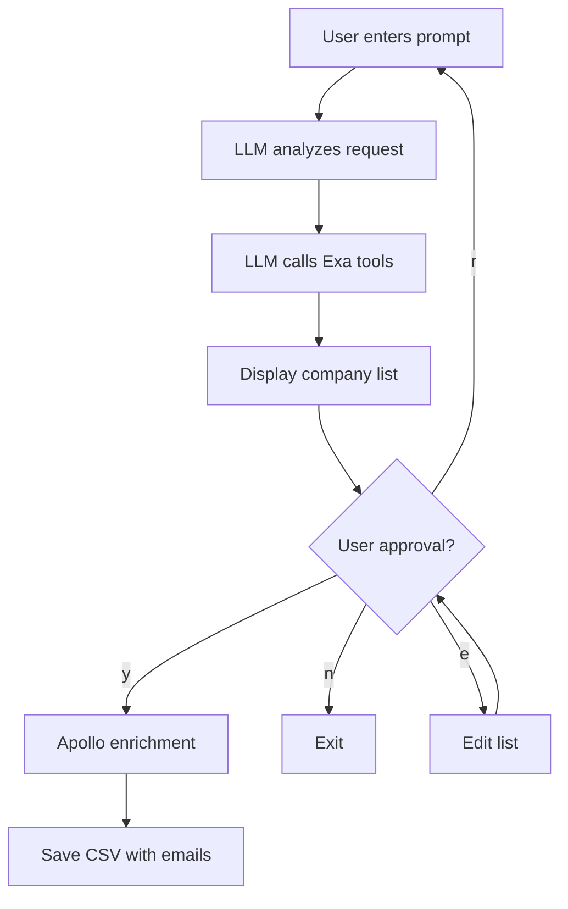

# Walkthrough: LLM Agent CLI for Sponsorship Finder

## Summary

Transformed [headhunter.py](file:///Users/tsumacpro/ScottyLabs/moneyprinter/find-companies/headhunter.py) into an interactive LLM-powered CLI agent that uses natural language prompts to find potential hackathon sponsors.

## Changes Made

### [pyproject.toml](file:///Users/tsumacpro/ScottyLabs/moneyprinter/pyproject.toml)

Added dependencies: `openai`, `exa_py`, `requests`, `pandas`

### [headhunter.py](file:///Users/tsumacpro/ScottyLabs/moneyprinter/find-companies/headhunter.py)

Complete refactor with three-phase workflow:

1. **LLM Agent Phase** - Uses GPT-4o with function calling to interpret natural language prompts and call Exa tools
2. **Approval Phase** - Displays discovered companies and awaits user approval
3. **Enrichment Phase** - Uses Apollo to find contact emails (non-LLM)

## How to Use

```bash
cd /Users/tsumacpro/ScottyLabs/moneyprinter/find-companies

# Set API keys
export OPENAI_API_KEY="your-key"
export EXA_API_KEY="your-key"  
export APOLLO_API_KEY="your-key"

# Run the agent
python headhunter.py
```

**Example prompts:**
- "Find companies for our hackathon that might give credits for their product"
- "Developer tools startups similar to Vercel"
- "Companies that sponsor university hackathons"

## Workflow


